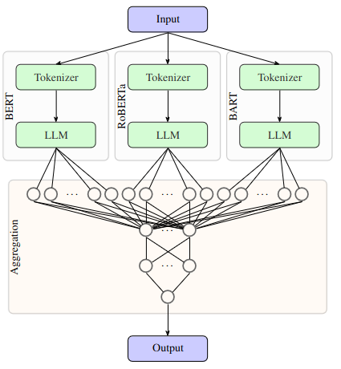

# Multi-Transformer for Sentiment Classification 





[Computational Intelligence Lab: Sentiment Analysis](report.pdf)

Kai Lascheit, Tjark Behrens and Jacob Hunecke 

## General
This GitHub contains the code for our model that we built within the Sentiment Analysis competition of the course Computational Intelligence Lab by Prof. Valentina Boeva and Prof. Thomas Hofmann.
Together with the created paper, this repository contains all the necessary information to understand and reproduce the results of our project work.

## Getting Started
Install dependencies

Create and activate a virtual environment
```
python3 -m venv env_cil
source env_cil/bin/activate
```

Install the [PyTorch and TorchVision](https://pytorch.org/get-started/locally/) versions which are compatible with your CUDA configuration. The environment setup was tested on CUDA 12.1, ${CUDA} should be replaced with the specific version (for CUDA 12.1, it is ${CUDA} = cu121).
```
pip install --no-cache-dir torch torchvision torchaudio --index-url https://download.pytorch.org/whl/${CUDA}
```
The remaining packages can be installed using our provided [requirements.txt](requirements.txt).
```
pip install -r requirements.txt
```

## Experiments
This repository already contains a small version of the provided twitter datasets. Keep in mind, that our final version was trained on the full dataset. Either substitute the according files ([train_pos.txt](twitter-datasets/train_pos.txt), [train_neg.txt](twitter-datasets/train_neg.txt)) or change the paths in line 311 and 312 of [transformer_multi.py](code/transformer_multi.py) to the full dataset.

To reproduce the results from our best submission in the Kaggle competition, run the command below from the main directory. Be aware that training requires a GPU with at least 24GB of GPU and lasts roughly 50 hours (or more depending on the computational ressources). 
```
python code/transformer_multi.py --models 'bert-large-uncased' 'roberta-large-openai-detector' 'facebook/bart-large-mnli' --seq_length 70 --epochs 20 --folder "multi" --save_name "multi-model" --hidden_width 512 --hidden_depth 2 --inference_name "multi" --batch=32 --freeze
```

This will create a folder called 'multi' containing the model weights with the best validation accuracy (multi-model.pth) and a corresponding prediction file that is ready to submit for the Kaggle competition (multi.csv).
To achieve other results from our experiment section, check out the possible variations of the argparse arguments. For more information: python code/transformer_multi.py --help


